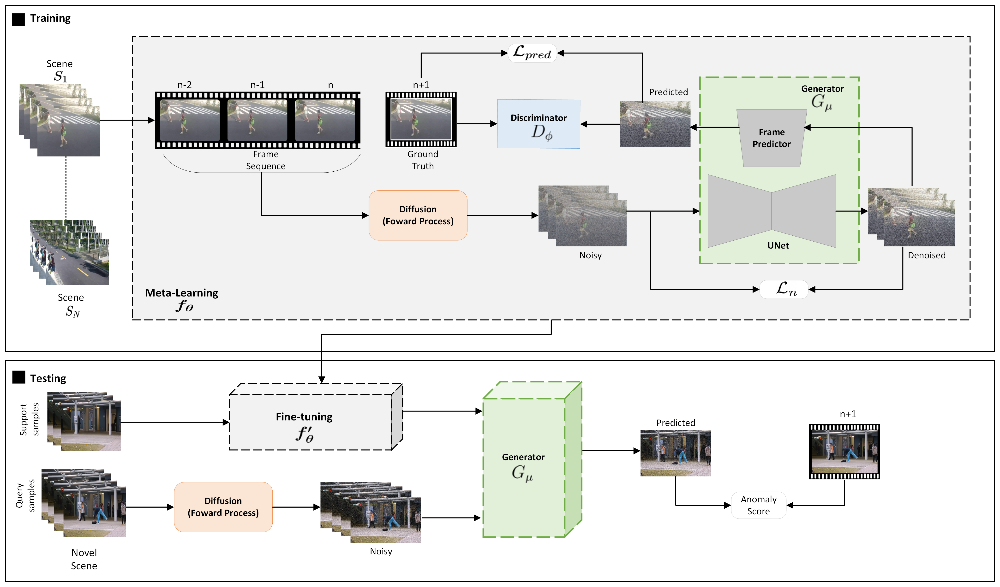

# Adversarial Diffusion for Few-Shot Scene Adaptive Video Anomaly Detection

This repository contains the official PyTorch implementation for **Adversarial Diffusion for Few-Shot Scene-Adaptive Video Anomaly Detection**. 

Our framework introduces a novel pipeline that integrates a **Denoising Diffusion model** with a future-frame prediction architecture inside a **Generative Adversarial Network (GAN)** meta-learning setup. By optimizing one-step high-fidelity future-frame synthesis and leveraging perceptual regularization metrics (MS-SSIM/PSNR), our model achieves rapid, high-performance scene adaptation under minimal episodic training iterations.

---

  

